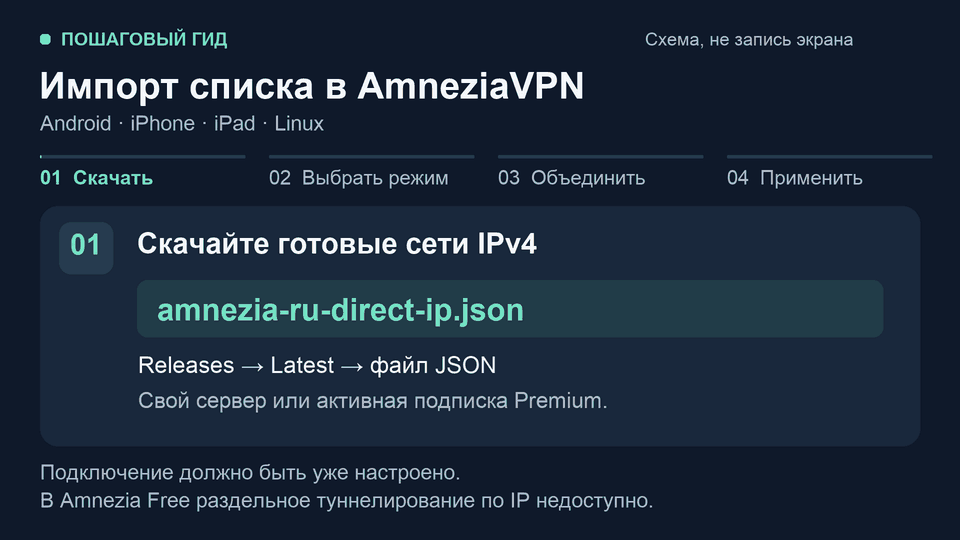

# Материалы для публикации

Адрес проекта сохраняем: [amnezia-vpn-russia-split-tunneling](https://github.com/w1zardz/amnezia-vpn-russia-split-tunneling).
Тексты ниже готовы к копированию. Они описывают текущие возможности проекта,
без сравнений с другими авторами и обещаний, что любой сайт обязательно заработает.

## Короткий пошаговый гид

[MP4 для загрузки в сообщество](media/split-tunneling-demo.mp4) ·
[GIF для README](media/split-tunneling-demo.gif).
960 × 540, 20 секунд, четыре шага. Это **схематический гид**, не запись экрана
и не доказательство работы конкретного подключения. Названия пунктов клиента
могут отличаться между версиями.

Шаги сверены с [ручным импортом проекта](../README.md#ручной-импорт-json)
и [официальной документацией Amnezia](https://docs.amnezia.org/ru/documentation/instructions/vpn-split-tunneling/).
Гид показывает режим исключений, используемый этим проектом; это не заявление
о том, что Amnezia рекомендует такой режим для всех задач.

## Reddit: заголовок

AmneziaVPN: список российских сетей + обновление на Windows/macOS без отключения активного VPN

## Reddit: текст

Сделал открытый проект для тех, кто пользуется AmneziaVPN и хочет направлять
выбранные российские сервисы напрямую. Добавленные IP/сети работают без VPN,
остальной трафик — по правилам вашего подключения.

Репозиторий: https://github.com/w1zardz/amnezia-vpn-russia-split-tunneling

Что есть:

- Готовый IPv4 JSON для ручного импорта на Android, iPhone, iPad и Linux.
- Установщики Windows/macOS: проверка раз в неделю, сохранение ручных записей.
  Если интерфейс Amnezia или туннель работают, применение по умолчанию
  откладывается. Работающий VPN обновлятор сам не отключает.
- Ежедневная сборка из ручного каталога сервисов; лимит публичной сборки —
  1000 маршрутов после объединения сетей и снимка DNS.
- Дополнительные файлы для Happ, Xray и WireGuard.

На телефоне: скачайте `amnezia-ru-direct-ip.json` из Releases →
AmneziaVPN → Настройки → Раздельное туннелирование сайтов →
«Адреса из списка не должны открываться через VPN» → меню ⋮ →
«Добавить импортированные сайты к существующим».
Потом включите функцию и переподключите VPN вручную.
Перед переподключением закройте приложения, которым нужен VPN:
в этот момент возможен доступ без туннеля. Ручной импорт не включает автообновление.

Нужно уже настроенное подключение к своему серверу или активная подписка
Amnezia Premium. В Amnezia Free раздельное туннелирование по IP недоступно.
Сервисы на добавленных адресах видят ваш обычный IP. Список не гарантирует,
что в нём есть каждый адрес сервиса; результат проверяйте на своём подключении.

Приложил короткий схематический гид по импорту.
Если проверите, напишите систему, версию Amnezia и какой сервис не открылся.
Ключи подключения и личные данные присылать не нужно.
Если пригодилось — поддержите проект звездой ⭐

## Telegram / профильное сообщество

Для AmneziaVPN сделал список российских IP/сетей, которые можно открывать напрямую.
На Windows/macOS — установщик с еженедельной проверкой и сохранением ручных
записей; при открытой Amnezia или работающем VPN применение по умолчанию отложится.
На Android/iPhone/iPad/Linux — ручной импорт `amnezia-ru-direct-ip.json`.
Есть форматы Happ/Xray/WireGuard; лимит публичной сборки — 1000 маршрутов.

Нужно настроенное подключение к своему серверу или активный Premium.
Amnezia Free не поддерживает IP-исключения. Добавленные адреса видят обычный IP;
полное покрытие каждого сервиса не гарантируется. Перед ручным переподключением
закройте приложения, которым нужен VPN: возможен выход без туннеля.
Гид — схема шагов, не запись экрана.

Скачать и настроить: https://github.com/w1zardz/amnezia-vpn-russia-split-tunneling
Если помогло — ⭐; если нет — система, версия клиента и сервис в Issues.

## Запуск на GitHub

[Объявление: быстрый старт, загрузки и памятка](https://github.com/w1zardz/amnezia-vpn-russia-split-tunneling/discussions/4).

Ответы в обсуждениях: [МЭШ](https://github.com/w1zardz/amnezia-vpn-russia-split-tunneling/discussions/1#discussioncomment-18744414) — запрошены данные для диагностики, исправление предупреждения не подтверждено;
[GL.iNet / OpenWrt](https://github.com/w1zardz/amnezia-vpn-russia-split-tunneling/discussions/2#discussioncomment-18744415) — подтверждена поддержка текстового формата и дана постоянная ссылка.

## Внешнее сообщество Amnezia

[Пост в официальном сообществе Amnezia, категория Show and tell](https://github.com/amnezia-vpn/amnezia-client/discussions/3258).
Публикация от `w1zardz`: описаны списки, установщики, ручной импорт и ограничения.
Пост доступен публично; новые отзывы будут учитываться в замере 18 октября.

## Статус публикации и следующие действия

На 4 октября 2026 года в рамках этого пакета:

- [x] GIF и MP4 подготовлены; четыре сцены визуально проверены.
- [x] Тексты для Reddit и сообщества подготовлены.
- [x] Короткий README, инструкции по платформам и описание проекта опубликованы.
- [x] Объявление в GitHub Discussions опубликовано; даны ответы в двух существовавших темах.
- [x] Внешний пост размещён в сообществе Amnezia — Show and tell.
- [x] Исходный замер сохранён приватно; проверка результата назначена на 18 октября 2026 года, 12:00 по Москве.
- [ ] Эти тексты опубликованы в Reddit. Ссылка после публикации: —
- [ ] Эти тексты опубликованы в Telegram/сообществе. Ссылка после публикации: —
- [ ] Получены новые ответы пользователей и разобраны воспроизводимые ошибки.
- [ ] Через 14 дней сравнить посетителей, источники и новые звёзды с исходным замером.

Перед публикацией проверить правила выбранного сообщества и загрузить MP4
как видео либо приложить GIF. Reddit и Telegram пока не опубликованы; ссылки на фактические публикации будут добавлены после размещения.
